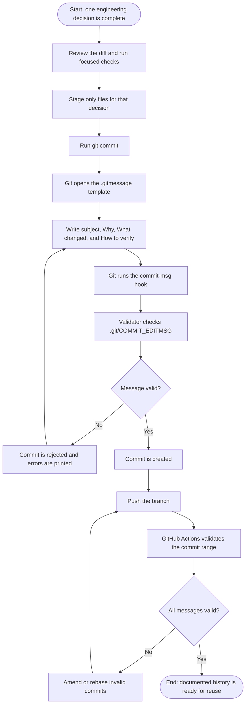
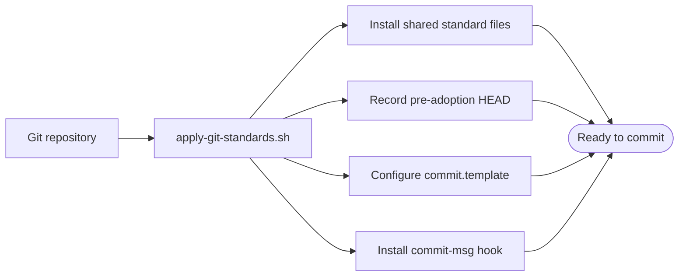
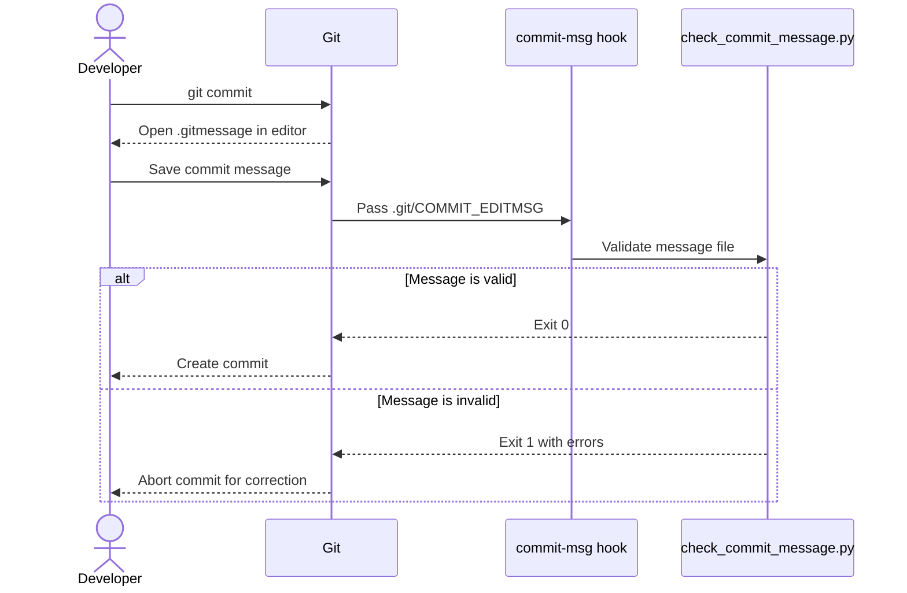
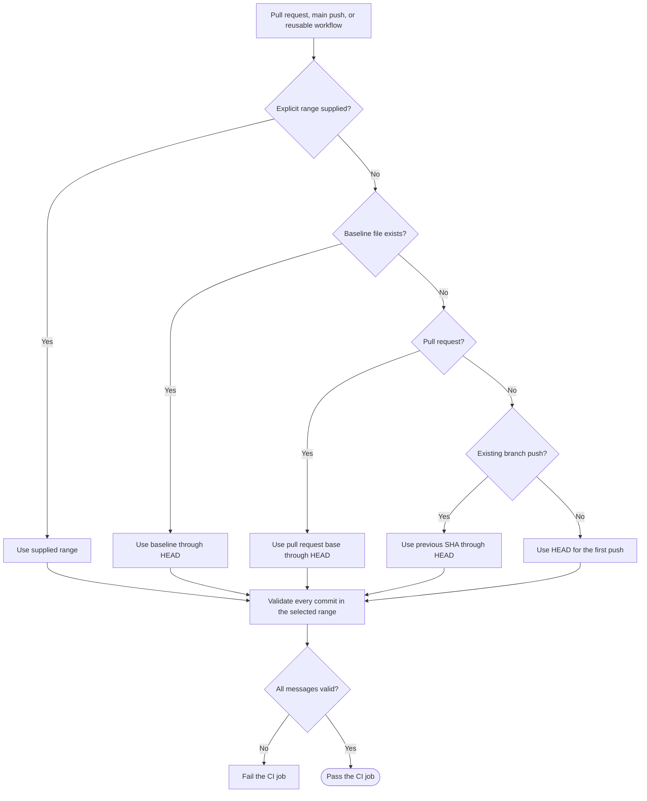

# Commit Workflow: Start to End

This guide shows how to create, validate, publish, and reuse a documented
commit. Read the [commit convention](commit-convention.md) for the complete
message specification.

## Complete flow



## 1. Install the standard once

From this repository, configure the current repository with:

```bash
./scripts/apply-git-standards.sh .
```

The script:

1. Installs the template, validator, context exporter, convention, and CI
   workflow.
2. Records the existing `HEAD` in `.commit-documentation-baseline` when the
   repository already has commits.
3. Configures `.gitmessage` as the local Git commit template.
4. Installs an executable `.git/hooks/commit-msg` hook.

The bootstrap flow is:



Verify the installation:

```bash
git config --local --get commit.template
test -x .git/hooks/commit-msg && echo "commit-msg hook is active"
```

The expected template value is `.gitmessage`.

### Optional pre-commit installation

Teams already using pre-commit can install the equivalent configured hook:

```bash
uv sync --dev
uv run pre-commit install --hook-type commit-msg
```

Both hook options invoke `scripts/check_commit_message.py`. One working
`commit-msg` hook is sufficient; the bootstrap hook does not require the
`pre-commit` package at commit time.

## 2. Prepare one commit

Review the work, run its focused checks, and stage one engineering decision:

```bash
git diff --check
git diff
uv run python -m unittest discover -s tests -v
git add path/to/implementation.py path/to/test.py
git diff --staged
```

Implementation, focused tests, and directly related documentation should
normally stay together. Unrelated refactors or dependency updates should use
separate commits.

## 3. Create an interactive commit

Run:

```bash
git commit
```

Git opens `.gitmessage` in the configured editor. Replace the commented
guidance with verified facts:

```text
feat(agent): stream tool execution events over SSE

Why:
HTTP clients need progress while the model executes CSV tools.

What changed:
- Added typed SSE events for tool calls, results, tokens, and completion.
- Preserved valid tool-message history in the bounded agent loop.

How to verify:
- `uv run python -m unittest discover -s tests -v` -> all tests pass.

Notes / Tradeoffs:
- Requests remain stateless.

Roadmap: Agent service and streaming
```

Save and close the editor. Git then invokes the validator automatically.

## 4. Create a non-interactive commit

Automation and coding agents can write the same message to a temporary file:

```bash
cat > /tmp/commit-message.txt <<'EOF'
docs(commits): explain the end-to-end commit workflow

Why:
Contributors need an operational guide in addition to the message specification.

What changed:
- Added setup, local validation, CI, and recovery flows.
- Added Mermaid diagrams for the complete lifecycle.

How to verify:
- Review the rendered Markdown -> all diagrams and links are readable.

Roadmap: Commit as documentation
EOF

python3 scripts/check_commit_message.py /tmp/commit-message.txt
git commit -F /tmp/commit-message.txt
rm /tmp/commit-message.txt
```

The explicit validator call gives early feedback. `git commit` still runs the
hook and validates the final message again.

## 5. Understand local validation



The validator requires:

- A Conventional Commit subject no longer than 72 characters.
- An allowed type: `feat`, `fix`, `refactor`, `perf`, `docs`, `test`, `build`,
  `ci`, `chore`, or `revert`.
- A blank line after the subject.
- Non-empty `Why:`, `What changed:`, and `How to verify:` sections in that
  order.

`Notes / Tradeoffs:` and supported trailers are optional. Git-generated merge,
revert, fixup, and squash subjects are exempt.

## 6. Correct a rejected message

The validator prints every detected problem. Correct the message and retry:

```bash
git commit
```

If a bad commit already exists locally, amend it:

```bash
git commit --amend
```

For multiple private commits, use an interactive rebase and mark the affected
commits for rewording:

```bash
git rebase -i <base-commit>
```

Do not rewrite commits other people may already use. Use `--no-verify` only
when the hook itself is broken, not to bypass a documentation error.

## 7. Push and pass CI

The GitHub Actions workflow selects a commit range and runs:

```bash
python3 scripts/check_commit_message.py --commit-range '<range>'
```



The baseline preserves pre-adoption history without rewriting it. Do not move
the baseline merely to hide a failing new commit.

## 8. Reuse commits as development context

After documented commits accumulate, export them as compact Markdown:

```bash
python3 scripts/export_commit_context.py --output /tmp/project-context.md
```

By default, the exporter includes commits after
`.commit-documentation-baseline`. Select a narrower range when needed:

```bash
python3 scripts/export_commit_context.py \
  --commit-range 'main..HEAD' \
  --output /tmp/branch-context.md
```

The resulting document contains each commit hash, subject, and body, making
the verified decision history available as starting context for future
developers and AI agents.

## Command summary

```bash
# Install once
./scripts/apply-git-standards.sh .

# Prepare and commit
git diff --check
git add <files>
git diff --staged
git commit

# Validate the complete post-adoption history
python3 scripts/check_commit_message.py \
  --commit-range "$(cat .commit-documentation-baseline)..HEAD"

# Export history as reusable context
python3 scripts/export_commit_context.py --output /tmp/project-context.md
```